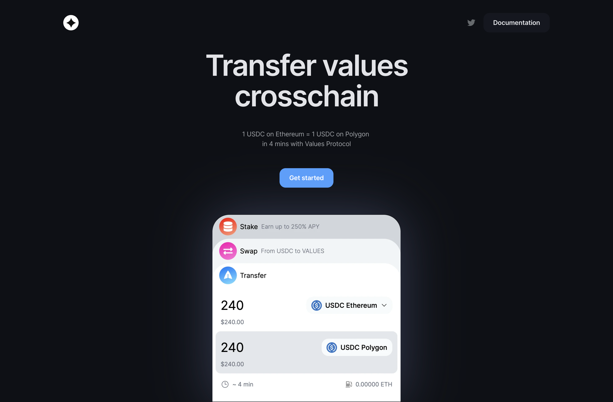

# What is Values?

Values is a decentralized platform that offers a comprehensive solution for the evaluation and compensation of contributions in online communities, particularly in the cryptocurrency space. It consists of three main components:

- **Values Protocol:** This refers to the smart contracts deployed across multiple blockchain networks, including Ethereum, and Polygon, that interact with each other through cross-chain messaging, a protocol facilitates transfer ERC-20 tokens from source chain to destination.
- **Values DAO:** An governance system that utilizes the VALUES token for governing the treasury and rewards mechanics. It allows for community members to have a say in how the platform is managed and operate.
- **Values Ecosystem:** Developers community that builds upon the Values Protocol, as well as web and mobile interfaces, partner events, and trading pairs with the VALUES token on decentralized and centralized exchanges.
